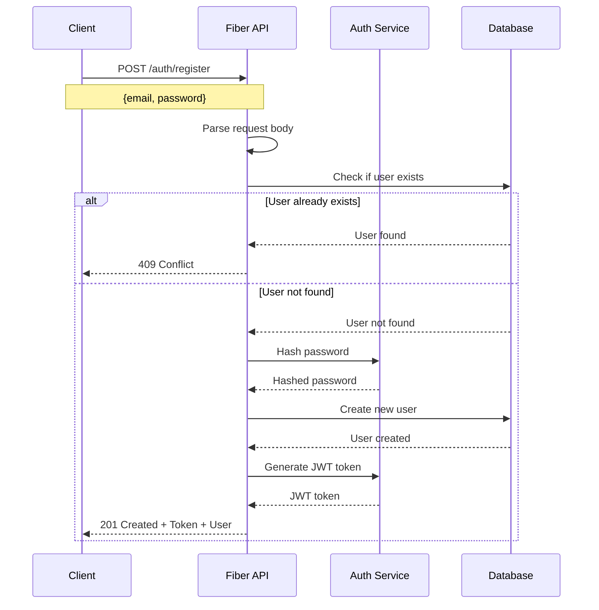
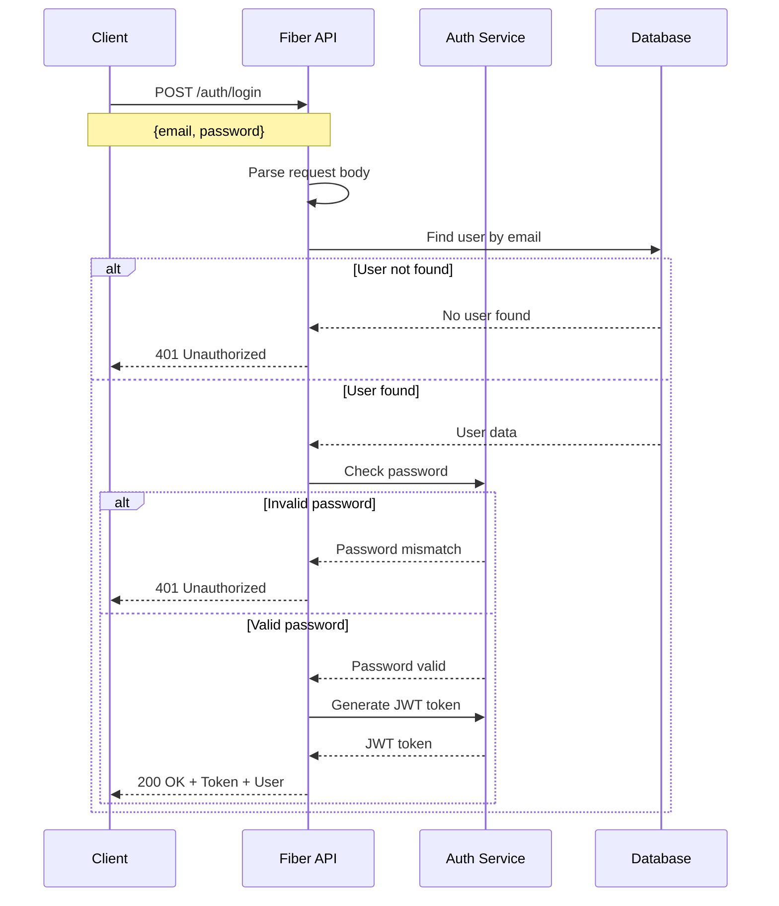
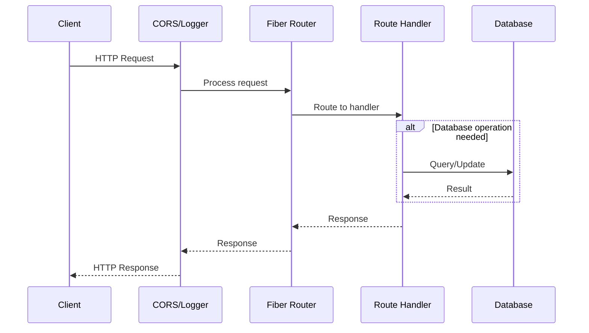
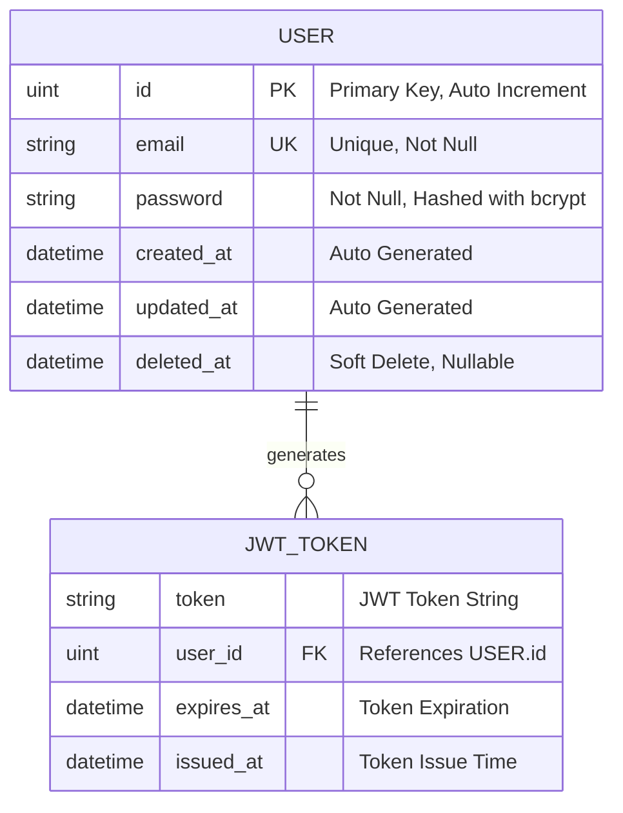

# Backend API Documentation

## Overview
This is a backend API built with Go Fiber framework that provides user authentication functionality with JWT tokens. The system includes user registration, login, and database management using GORM with SQLite.

## System Architecture

### Components
- **Go Fiber**: Web framework for handling HTTP requests
- **GORM**: ORM for database operations
- **SQLite**: Database for storing user data
- **JWT**: Token-based authentication
- **Bcrypt**: Password hashing
- **Swagger**: API documentation

## Sequence Diagrams

### User Registration Flow



### User Login Flow



### API Request Flow



## Entity Relationship Diagram



## Data Models

### User Model
```go
type User struct {
    ID       uint   `json:"id" gorm:"primaryKey"`
    Email    string `json:"email" gorm:"unique;not null"`
    Password string `json:"-" gorm:"not null"`
}
```

### Request/Response Models
```go
type LoginRequest struct {
    Email    string `json:"email" validate:"required,email"`
    Password string `json:"password" validate:"required,min=6"`
}

type RegisterRequest struct {
    Email    string `json:"email" validate:"required,email"`
    Password string `json:"password" validate:"required,min=6"`
}

type AuthResponse struct {
    Token string `json:"token"`
    User  User   `json:"user"`
}
```

## API Endpoints

### Authentication Routes

| Method | Endpoint | Description | Request Body | Response |
|--------|----------|-------------|--------------|----------|
| POST | `/auth/register` | Register new user | `RegisterRequest` | `AuthResponse` |
| POST | `/auth/login` | Login user | `LoginRequest` | `AuthResponse` |
| GET | `/` | Health check | None | `{message: "hello world"}` |
| GET | `/swagger/*` | API Documentation | None | Swagger UI |

## Security Features

1. **Password Hashing**: Uses bcrypt with default cost for secure password storage
2. **JWT Authentication**: Tokens expire in 72 hours
3. **Input Validation**: Email format and password minimum length validation
4. **CORS Protection**: Cross-origin request handling
5. **Request Logging**: All requests are logged for monitoring

## Database Schema

The system uses SQLite database with GORM for the following benefits:
- **Auto Migration**: Database schema is automatically created/updated
- **Soft Deletes**: Records are marked as deleted instead of being removed
- **Timestamps**: Automatic created_at and updated_at tracking
- **Relationships**: Easy foreign key management

## Technology Stack

- **Backend Framework**: Go Fiber v2
- **Database ORM**: GORM
- **Database**: SQLite
- **Authentication**: JWT with golang-jwt/jwt/v5
- **Password Hashing**: bcrypt
- **Documentation**: Swagger with swaggo/fiber-swagger
- **Middleware**: CORS, Logger

## Environment Setup

1. Go 1.19+
2. Required packages:
   - github.com/gofiber/fiber/v2
   - gorm.io/gorm
   - gorm.io/driver/sqlite
   - github.com/golang-jwt/jwt/v5
   - golang.org/x/crypto/bcrypt
   - github.com/swaggo/fiber-swagger